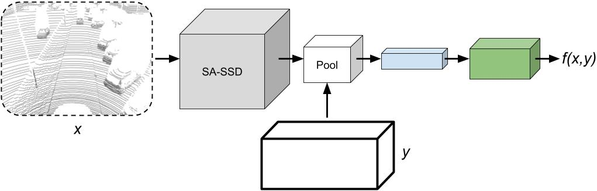

# ebms_3dod



Official implementation (PyTorch) of the paper: \
**Accurate 3D Object Detection using Energy-Based Models**, 2020 [[arXiv]](https://arxiv.org/abs/2012.04634) [[project]](http://www.fregu856.com/publication/ebms_3dod/). \
[Fredrik K. Gustafsson](http://www.fregu856.com/), [Martin Danelljan](https://martin-danelljan.github.io/), [Thomas B. Schön](http://user.it.uu.se/~thosc112/). \
_We apply energy-based models p(y|x; theta) to the task of 3D bounding box regression, extending the recent energy-based regression approach from 2D to 3D object detection. This is achieved by designing a differentiable pooling operator for 3D bounding boxes y, and adding an extra network branch to the state-of-the-art 3D object detector SA-SSD. We evaluate our proposed detector on the KITTI dataset and consistently outperform the SA-SSD baseline, demonstrating the potential of energy-based models for 3D object detection._

[Youtube video](https://youtu.be/7JP6V818bh0) with qualitative results: \
[](https://youtu.be/7JP6V818bh0)

If you find this work useful, please consider citing:
```
@article{gustafsson2020accurate,
  title={Accurate 3D Object Detection using Energy-Based Models},
  author={Gustafsson, Fredrik K and Danelljan, Martin and Sch{\"o}n, Thomas B},
  journal={arXiv preprint arXiv:2012.04634},
  year={2020}
}
```


## Acknowledgements
TODO!


## Index
TODO!
***
***
***


***
***
***

The code will be uploaded soon!
